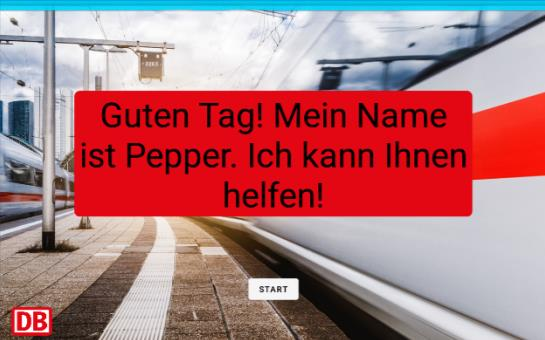
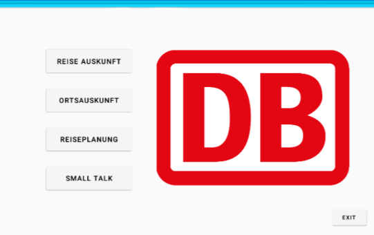
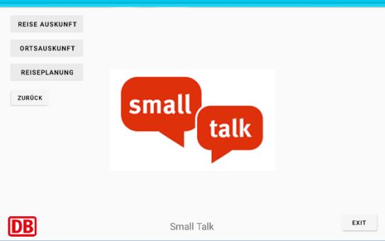
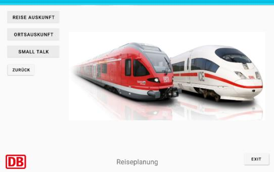
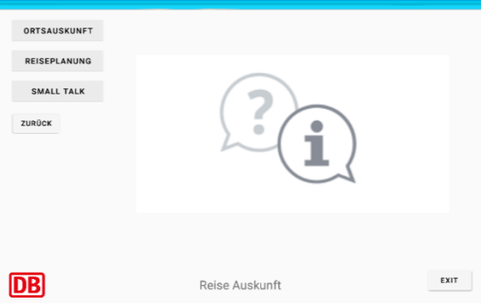
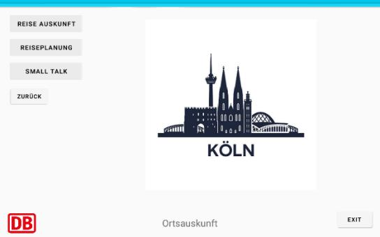

# Entwicklung-anthropomorpher-Maschinen-Systeme
Pepper QiSDK - information desk Application with the Cologne Centralsation as location 
---
## Disklamer

The project is in German only!

The project is done since 05.2021.

---
## Pictures from the menus







---

## Cite

```
@misc{EAM,
  author = "Jan Teigelkötter"
  title = "Entwicklung Anthropomorphe Maschinen - Einsatz von Pepper als Informationssystem am Kölner Hauptbahnhof",
  year = 2015,
  url = "https://github.com/jan-tgk/Entwicklung-anthropomorpher-Maschinen-Systeme"
}
```